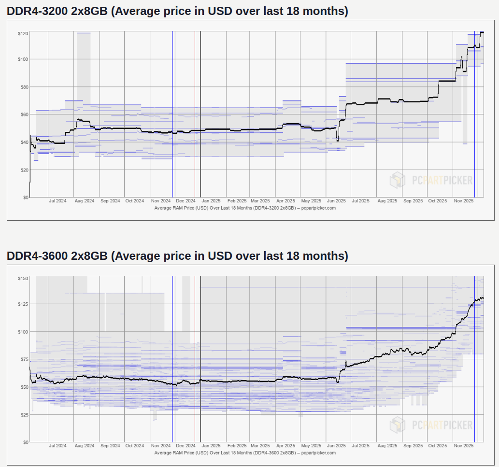

	# Project Liliput

## Free lunch?

--

## About me

**Konrad Szałkowski**

- Principal software engineer (CFS Omega)
- Java enthusiast & Poznań JUG leader
- Dreams of marrying Java & GPUs

---

## Costs

--

## Cloud costs

--

## Ingredients

- CPU time
- Memory
- Storage

--

## GCP Cloud CUD

| vCPUs | C4-Standard (USD/hour) | C4-Highmem (USD/hour) |
|-------|------------------------|-----------------------|
| 2     | 0.06974352             | 0.0924264             |
| 16    | 0.5692896              | 0.75075264            |
| 48    | 1.7078688              | 2.25225792            |
| 192   | 6.8314752              | 9.00903168            |

~ +30% more expensive

--

  

--

## Memory is also cost driver

--

## What if we can spare some $$?

--

## For almost no cost?

---

## Java

--

## Java as platform

- Language
- JVM

--

## Enterprise choice no.1

--

## Reasons

- WORA (hardware independence) 
- Backwards compatibility
- Security 
- Rich ecosystem
- Battle proven

--

## Why developers are (were) not so fond of java?

- Legacy solutions
- Bloat code
- Nothing new for a long periods of time
- JVM not efficient

--

  

--

## Change

Since 2017 Java is released twice a year.

Every 4 releases 1 is marked as LTS.

--

## Language evolution

- New language constructs
- Smaller code
- Better code safety
- ...

--

## JVM is also evolving

- Virtual Threads
- Better JIT Compiler
- Faster machine code
- ...

--

## Evolution for better future in cloud driven world  

---

## Java

Java is Object Oriented Programming Language

--

## Objects

Pieces of related data stored in memory  

JVM memory

--

## Object header

Handler of object  

Occupies memory

--

## Object header

- Mark Word (64 Bits)
  - Identity hash code (31 bits)
  - GC Data (4 bits)
  - Lock tag bits (3 bits)
  - Reserved bits / biased locking bits (26 bits)
- Class pointer (64 bits)

--

## Project Liliput

Compact Object Headers  
JEP 450/519

--

## Version 1

128 bits -> 64 bits

--

## Why was it possible?

- JEP 374 - Remove biased locking

- Mark Word (64 Bits)
  - Identity hash code (31 bits)
  - GC Data (4 bits)
  - Lock tag bits (3 bits)
  - ~~Reserved bits / biased locking bits (26 bits)~~
- Class pointer (64 bits)

--

## Why was it possible?

- 2^64 =  18 446 744 073 709 551 616

- Mark Word ~~(64 Bits)~~ -> 38 bits 
  - Identity hash code (31 bits)
  - GC Data (4 bits)
  - Lock tag bits (3 bits)
  - ~~Reserved bits / biased locking bits (26 bits)~~
- ~~Class pointer (64 bits)~~ -> (26 bits)

---

## Code demo

--

## Results from around the world

10-20% shrink in memory size  
10% less CPU time

--

## Project Liliput
## Version 2 (hold my beer)

128 bits -> 32 bits

---

## Links

https://www.baeldung.com/java-object-header-reduced-size-save-memory  
https://www.happycoders.eu/java/compact-object-headers/  
https://www.youtube.com/watch?v=kHJ1moNLwao  
https://www.youtube.com/watch?v=9ioh6kprnPE  
https://wiki.openjdk.org/display/lilliput/Main  

--

## Q&A

